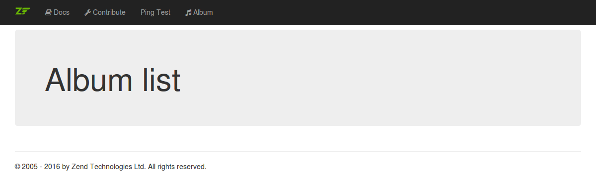

# Part 2: Album list middleware

We will now setup a new middleware to show the album list. We will not have any
data to display just yet, but the exercise will demonstrate writing your first
middleware.

## Create the Album module

In a [blog post](https://framework.zend.com/blog/2017-04-11-expressive-tooling.html)
the `zend-expressive` tools are explained.
> With the 2.0 release, we provided several migration tools, as well as tooling for
creating, registering, and deregistering middleware modules

Let's use some of them, first the `module` tool.
Let's create an `Album` module:
```bash
$ ./vendor/bin/expressive module:create Album
```
> At this point, we have a module with no code! Let's rectify that situation!

## Create the album list middleware

```bash
$ ./vendor/bin/expressive middleware:create "Album\Action\AlbumListAction"
```
a new file `src/Album/src/Action/AlbumListAction.php` is created:
```php
<?php

namespace Album\Action;

use Interop\Http\ServerMiddleware\DelegateInterface;
use Interop\Http\ServerMiddleware\MiddlewareInterface;
use Psr\Http\Message\ServerRequestInterface;

class AlbumListAction implements MiddlewareInterface
{
    /**
     * {@inheritDoc}
     */
    public function process(ServerRequestInterface $request, DelegateInterface $delegate)
    {
        // $response = $delegate->process($request);
    }
}
```

Let's modify the content of this file to the following:
```php
<?php

namespace Album\Action;

use Interop\Http\ServerMiddleware\DelegateInterface;
use Interop\Http\ServerMiddleware\MiddlewareInterface as ServerMiddlewareInterface;
use Psr\Http\Message\ResponseInterface;
use Psr\Http\Message\ServerRequestInterface;
use Zend\Diactoros\Response\HtmlResponse;
use Zend\Expressive\Template\TemplateRendererInterface;

class AlbumListAction implements ServerMiddlewareInterface
{
    /**
     * @var TemplateRendererInterface
     */
    private $template;

    /**
     * @param TemplateRendererInterface $template
     */
    public function __construct(TemplateRendererInterface $template)
    {
        $this->template = $template;
    }

    /**
     * {@inheritDoc}
     */
    public function process(ServerRequestInterface $request, DelegateInterface $delegate)
    {
        $data = [];

        return new HtmlResponse(
            $this->template->render('album::list', $data)
        );
    }
}
```

Since the `AlbumListAction` needs to render a template, it depends on the
template renderer; we model that by having a `TemplateRendererInterface
$template` argument in the class constructor.

The `process()` method is the middleware itself, and it creates and returns an
`HtmlResponse`. The injected template renderer is used to create the content for
the response, and renders our album list template.  Since we have no data to
output yet, an empty array is passed to the renderer.

> ### Interfaces and classes used
>
> Some of the interfaces and classes referenced in the above example may look
> unfamiliar; below are details on each.
>
> - The `Psr\Http\Message` namespace contains a set of standardized HTTP
>   message interfaces which are also known as [PSR-7](http://www.php-fig.org/psr/psr-7/).
>   Many PHP frameworks and open source projects consume these interfaces within
>   their projects, as they provide a convenient and interoperable abstraction
>   around HTTP messages.
>
> - The component [`Zend\Diactoros`](https://github.com/zendframework/zend-diactoros)
>   contains a PSR-7 implementation provided by the Zend Framework project, and
>   is the default implementation used by Expressive.
>
> - `HtmlResponse` is a convenience class for creating HTTP responses with HTML
>   content. By default, these responses have a 200 HTTP status code and a
>   Content-Type set to `text/html`.
>
>   Note that the `HtmlResponse` class also accepts a status code and headers as
>   additional arguments. You can seed your instance with the status code and
>   headers present in the response instance passed to the middleware if
>   desired:
>
> ```php
> <?php
> return new HtmlResponse(
>     $this->template->render('album::list', $data),
>     $response->getStatusCode(),
>     $response->getHeaders()
> );
> ```
>
> ### Middleware typehints
>
> Most examples in this tutorial will use typehinting for the middleware:
>
> ```php
> <?php
> public function process(
>     ServerRequestInterface $request,
>     DelegateInterface $delegate,
> )
> ```
>
> This can be somewhat cumbersome and repetitious when writing your code. As
> such, you will often see middleware examples that omit the typehints:
>
> ```php
> <?php
> public function process($request, $delegate)
> ```
>
> When you see such code, keep the typehints from the previous example in mind.

## Create a factory for the album list middleware

In order to work, the `AlbumListAction` requires a `TemplateRendererInterface`
instance. How can we ensure one is injected? Create a factory, and inform the
container about it!

At this time, create the file `AlbumListActionFactory.php` within
the same directory as the `AlbumListAction` class file, with the following
contents:

```php
<?php

namespace Album\Action;

use Interop\Container\ContainerInterface;
use Zend\Expressive\Template\TemplateRendererInterface;

class AlbumListActionFactory
{
    /**
     * @param ContainerInterface $container
     * @return AlbumListAction
     */
    public function __invoke(ContainerInterface $container)
    {
        $template = $container->get(TemplateRendererInterface::class);

        return new AlbumListAction($template);
    }
}
```

The `__invoke()` method defines a factory for creating and returning an
`AlbumListAction` instance. Internally, it fetches a template renderer instance
from the DI container using the interface name, and the returned value is passed
to the `AlbumListAction` constructor.

Projects can assign their desired template renderer implementation to the
service named after the interface, allowing the ability to swap implementations
and ensure interoperability.

We can now use this factory to create an `AlbumListAction` instance.

> ### container-interop
>
> `Interop\Container\ContainerInterface` is provided by the [container-interop]
> (https://github.com/container-interop/container-interop) package,
> which tries to standardize features in container objects
> (service locators, dependency injection containers, etc.) to achieve
> interoperability.

> ### Factory typehints
>
> Most examples in this tutorial will use typehinting for factories:
>
> ```php
> <?php
> public function __invoke(ContainerInterface $container)
> ```
>
> For simplicity, and interoperability, many developers omit the typehint:
>
> ```php
> <?php
> public function __invoke($container)
> ```
>
> This is particularly true for users of zend-servicemanager; that project, prior to the
> 2.6.0 release, did not implement `ContainerInterface`, though its signature
> was compatible. As such, omitting the typehint allowed re-use of factories.
>
> When you see such code, keep the typehints from the first example in mind.

## Create a template for listing albums

We now need a template file for the album list. First, create
the path `src/Album/templates/album/` in the root of the project:

```bash
$ mkdir -p src/Album/templates/album
```

(or use whatever filesystem tools you're familiar with)

Now, place a new `list.phtml` file within that path, with the following
contents:

```php
<?php $this->headTitle('Albums'); ?>

<div class="jumbotron">
    <h1>Album list</h1>
</div>
```

This template sets the title of the page, and prints the heading within a
div that is styled by [Bootstrap](http://getbootstrap.com/). Please note,
that there is no echo needed for the `$this->headTitle()` call since the
output of the page title is done within the layout file
(`templates/layout/default.phtml`).

## Tell the application about the middleware and template

Currently, our Expressive application is unaware of the new action and template.
Let's notify zend-view of our template.

Since we have created our own module `Album` and we are using `zendframework/zend-config-aggregator`
, we can put all the module related configuration in the file `ConfigProvider.php`,
which is located at `src/Album/src/`.
This file was atuomatically created by the above mentioned command `./vendor/bin/expressive module:create Album`.

Let's modify the contents as following:

```php
<?php

namespace Album;

/**
 * The configuration provider for the Album module
 *
 * @see https://docs.zendframework.com/zend-component-installer/
 */
class ConfigProvider
{
    /**
     * Returns the configuration array
     *
     * To add a bit of a structure, each section is defined in a separate
     * method which returns an array with its configuration.
     *
     * @return array
     */
    public function __invoke()
    {
        return [
            'dependencies' => $this->getDependencies(),
            'templates'    => $this->getTemplates(),
        ];
    }

    /**
     * Returns the container dependencies
     *
     * @return array
     */
    public function getDependencies()
    {
        return [
            'invokables' => [
            ],
            'factories'  => [
                Action\AlbumListAction::class => Action\AlbumListActionFactory::class,
            ],
        ];
    }

    /**
     * Returns the templates configuration
     *
     * @return array
     */
    public function getTemplates()
    {
        return [
            'paths' => [
                'album' => [__DIR__ . '/../templates/album'],
            ],
        ];
    }
}

```

- Within the `dependencies` configuration section you can configure the
  DI container (zend-servicemanager in our project). We use the class name of
  the new `AlbumListAction` as the service identifier, and the class name of the
  `AlbumListActionFactory` as the factory that will return an instance for that
  service.

- Within the `templates` configuration section, we configure the paths
  for the templates and map them to virtual namespaces. In the above, we've
  mapped the template namespace `album` to the path `/src/Album/templates/album/`.
  This allows the template `album::list` to map to the template file
  `/src/Album/templates/album/list.phtml`.

## Routing

Expressive 1 used configuration-driven pipelines and routing;
Expressive 2 switches to use programmatic pipelines and routes instead.
The programmatic approach was chosen as many developers have indicated they find it
easier to understand and easier to read, and ensures they do not have any configuration conflicts.
See blog articles [expressive-2-migration](https://framework.zend.com/blog/2017-03-13-expressive-2-migration.html)
and [expressive-config-routes](https://framework.zend.com/blog/2017-03-30-expressive-config-routes.html) for further details.

Modify the file `routes.php` in the directory `config/` with the following content:

```php
<?php
$app->get('/', App\Action\HomePageAction::class, 'home');
$app->get('/api/ping', App\Action\PingAction::class, 'api.ping');
$app->get('/album', Album\Action\AlbumListAction::class, 'album');
```

- The configuration above defines the route named `album`, with the
  path `/album`, and maps it to our new `AlbumListAction` middleware.
  With the `get()`-Action the access is restricted to GET requests for this route.

## Provide navigation

How will users know the new page exists? Let's add a link to the new page within
the menu.

As we have chosen the modular structure in the installation process, the default layout
is located in a `module` with the name `App`.
Open the `src/App/templates/layout/default.phtml` file and add the link to the album
list by using the name of the route we configured in the previous section:

```html
<body class="app">
    <header class="app-header">
        <nav class="navbar navbar-inverse navbar-fixed-top" role="navigation">
            <div class="container">
                <!-- ... -->
                <div class="collapse navbar-collapse">
                    <ul class="nav navbar-nav">
                        <!-- ... -->
                        <li>
                            <a href="<?= $this->url('album') ?>">
                                <i class="fa fa-music"></i> Album
                            </a>
                        </li>
                    </ul>
                </div>
            </div>
        </nav>
    </header>
    <!-- ... -->
</body>
```

## Write tests

Development should be accompanied by tests. Let's create some initial tests for
our middleware.

First, create the directory `test/AlbumTest/Action/`:

```bash
$ mkdir -p test/AlbumTest/Action/
```

(or use the filesystem tools you are familiar with)

Now create the file `AlbumListActionTest.php` in this new path. This test case
should test the action we just created, and specifically that it returns an
instance of `Zend\Diactoros\Response\HtmlResponse` with expected content.

Add the following content to the file `test/AlbumTest/Action/AlbumListActionTest.php`:

```php
<?php

namespace AlbumTest\Action;

use Album\Action\AlbumListAction;
use Interop\Http\ServerMiddleware\DelegateInterface;
use PHPUnit\Framework\TestCase;
use Prophecy\Argument;
use Psr\Http\Message\ServerRequestInterface;
use Zend\Diactoros\Response\HtmlResponse;
use Zend\Expressive\Template\TemplateRendererInterface;

class AlbumListActionTest extends TestCase
{
    /**
     * Test if action renders the album list
     */
    public function testActionRendersAlbumListTemplate()
    {
        $renderer = $this->prophesize(TemplateRendererInterface::class);
        $renderer
            ->render('album::list', Argument::type('array'))
            ->shouldBeCalled()
            ->willReturn('BODY');

        $action = new AlbumListAction($renderer->reveal());

        $response = $action->process(
            $this->prophesize(ServerRequestInterface::class)->reveal(),
            $this->prophesize(DelegateInterface::class)->reveal()
        );

        $this->assertInstanceOf(HtmlResponse::class, $response);
        $this->assertEquals('BODY', $response->getBody());
    }
}
```

While it may seem unnecessary, we will also create a test for the factory. This
ensures that as you make changes to your class, dependencies, or instantiation,
you don't introduce bugs!

Create the file `AlbumListActionFactoryTest.php` in the same path as the previous
test, and write a test verifying the factory returns an `AlbumListAction`
instance:

```php
<?php

namespace AlbumTest\Action;

use Album\Action\AlbumListAction;
use Album\Action\AlbumListActionFactory;
use Interop\Container\ContainerInterface;
use PHPUnit\Framework\TestCase;
use Zend\Expressive\Template\TemplateRendererInterface;

class AlbumListActionFactoryTest extends TestCase
{
    /** @var ContainerInterface */
    protected $container;

    /**
     * Setup test case
     */
    protected function setUp()
    {
        $this->container = $this->prophesize(ContainerInterface::class);
    }

    /**
     * Test if factory returns the correct action
     */
    public function testFactoryReturnsAlbumListAction()
    {
        $this->container
            ->get(TemplateRendererInterface::class)
            ->willReturn($this->prophesize(TemplateRendererInterface::class));

        $factory = new AlbumListActionFactory();
        $this->assertInstanceOf(AlbumListActionFactory::class, $factory);

        $action = $factory($this->container->reveal());
        $this->assertInstanceOf(AlbumListAction::class, $action);
    }
}
```

## Add autoloading

In order to use the new classes we've created, we need to ensure our autoloader
can find them! We can do this in the `composer.json` file by adding the new
`Album` namespace and mapping it to the `src/Album/src` path.
As we have used the `expressive` script to create the Album module, this has
already been done by that script.
Open that file, and check that the `autoload.psr-4` section reads as follows:

```javascript
{
    "autoload": {
        "psr-4": {
            "App\\": "src/App/src",
            "Album\\": "src/Album/src"
        }
    },
}
```

You will need to map the `AlbumTest` namespace to the `test/AlbumTest/`
path; however, this only needs to be done for *development*, and, as such, we'll
add the entry to the `autoload-dev.psr4` section of the `composer.json`:

```javascript
{
    "autoload-dev": {
        "psr-4": {
            "AppTest\\": "test/AppTest/",
            "AlbumTest\\": "test/AlbumTest/"
        }
    },
}
```

Note: do not add or remove anything else! When you get done, run `composer
validate` to ensure the changes you made are still valid.

Adding the entry only tells Composer about the autoloading, but does not update
the autoloader. To do that, run the following command:

```bash
$ composer dump-autoload
```

## Setup PHPUnit

Setting up [PHPUnit](https://phpunit.de/) for testing is quite simple.  Edit the
`phpunit.xml.dist` file in the project root, and add the album test directory to
the test suite:

```xml
<phpunit bootstrap="./vendor/autoload.php" colors="true">
    <testsuites>
        <testsuite name="App\\Tests">
            <directory>./test/AppTest</directory>
        </testsuite>
        <testsuite name="Album\\Tests">
            <directory>./test/AlbumTest</directory>
        </testsuite>
    </testsuites>

    <filter>
        <whitelist processUncoveredFilesFromWhitelist="true">
            <directory suffix=".php">src</directory>
        </whitelist>
    </filter>
</phpunit>
```

To run the tests, execute the following from the project root:

```
$ phpunit
```

## Browse to the album list

Now that we have verified programmatically what we've written, let's see what we
get in the browser!

If you do not have the built-in web server running, fire it up now:

```bash
$ composer serve
```

Now browse to [http://localhost:8080/album](http://localhost:8080/album) to see if the
album page was setup properly.



## Compare with example repository branch `part2`

You can compare your code with the example repository when looking at the branch
`part2`. If you want you can even clone it and have a deeper look.

- [https://github.com/lowtower/zend-expressive2-tutorial/tree/part2](https://github.com/lowtower/zend-expressive2-tutorial/tree/part2_album-module)
