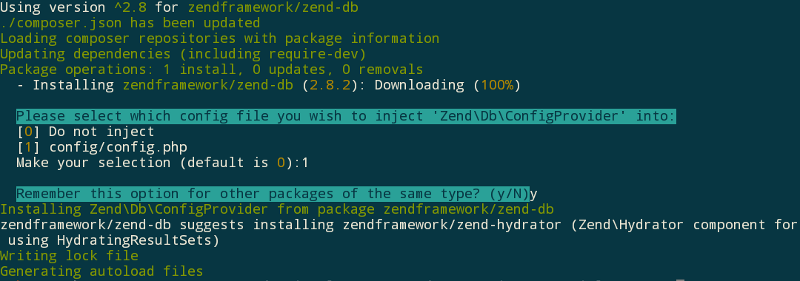
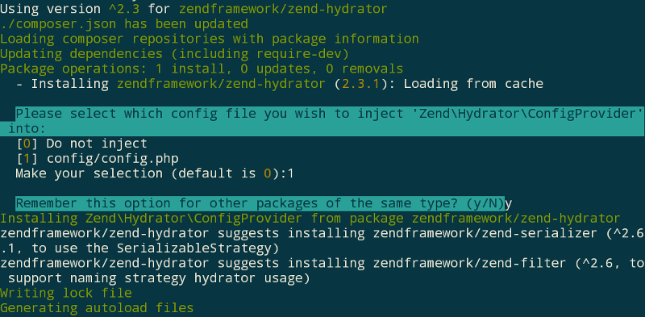

# Part 3: Model and database

In this part of the tutorial, we will setup a database and implement the
model layer for our application. At the end of this chapter, the album list
page will show the data from the database.

## Setup the database and the database connection

First, we need to setup the database. We will use sqlite for this tutorial.
A working sqlite database resides in the directory `data`.

Create a new database called `album-tutorial.sqlite`, and then run the following SQL
statements to create the `album` table, along with some test data.

```sql
CREATE TABLE IF NOT EXISTS `album` (
    `id`     INTEGER PRIMARY KEY AUTOINCREMENT,
    `artist` VARCHAR(100) NOT NULL,
    `title`  VARCHAR(100) NOT NULL
);
INSERT INTO `album` (`artist`, `title`)
    VALUES  ('The Military Wives',  'In My Dreams');
INSERT INTO `album` (`artist`, `title`)
    VALUES  ('Adele',  '21');
INSERT INTO `album` (`artist`, `title`)
    VALUES  ('Bruce Springsteen', 'Wrecking Ball (Deluxe)');
INSERT INTO `album` (`artist`, `title`)
    VALUES  ('Lana Del Rey', 'Born To Die');
INSERT INTO `album` (`artist`, `title`)
    VALUES  ('Gotye', 'Making Mirrors');
```

## Install `Zend\Db` component

Next, we'll add the [zend-db](https://github.com/zendframework/zend-db)
component to the application, using composer:

```
$ composer require zendframework/zend-db
```

When you run this installation via Composer the `Zend\ComponentInstaller`
steps in here now and asks you if you want to inject the
`Zend\Db\ConfigProvider` into your config file. You should select it with
the choice of `1` and also remember your decision with `y`. It should look
like this:



Please note that your `/config/config.php` should be updated as well by
adding the `Zend\Db\ConfigProvider`:

```php
<?php

use Zend\ConfigAggregator\ArrayProvider;
use Zend\ConfigAggregator\ConfigAggregator;
use Zend\ConfigAggregator\PhpFileProvider;

// To enable or disable caching, set the `ConfigAggregator::ENABLE_CACHE` boolean in
// `config/autoload/local.php`.
$cacheConfig = [
    'config_cache_path' => 'data/config-cache.php',
];

$aggregator = new ConfigAggregator([
    \Zend\Db\ConfigProvider::class,
    \Album\ConfigProvider::class,
    // Include cache configuration
    new ArrayProvider($cacheConfig),

    // Default App module config
    App\ConfigProvider::class,

    // Load application config in a pre-defined order in such a way that local settings
    // overwrite global settings. (Loaded as first to last):
    //   - `global.php`
    //   - `*.global.php`
    //   - `local.php`
    //   - `*.local.php`
    new PhpFileProvider('config/autoload/{{,*.}global,{,*.}local}.php'),

    // Load development config if it exists
    new PhpFileProvider('config/development.config.php'),
], $cacheConfig['config_cache_path']);

return $aggregator->getMergedConfig();
```

To configure database access, create the file
`/config/autoload/database.global.php` with the following contents:

```php
<?php

return [
    'db' => [
        'driver' => 'pdo',
        'dsn'    => 'sqlite:./data/album-tutorial.sqlite',
    ],
];
```
> Please note that we put the configuration of the database
> in a global configuration file and not in the `ConfigProvider`
> as the database might be used for different modules as well and
> thus is not `album module` specific.

The `db` configuration section defines the database connection. We will
use the PDO driver with a sqlite database, and the database table and user
we created above.

> ### Store credentials in `*.local.php` files when using MySQL databases
>
> The above example stores the database credentials in a "global" configuration
> file. **DO NOT DO THIS.**
>
> In your global configuration files, put in empty credentials. Then, in a file
> named `database.local.php`, add the same structure, and provide the
> credentials:
>
> ```php
> <?php
> return [
>     'db' => [
>         'driver'  => 'pdo',
>         'dsn'     => 'mysql:dbname=album-tutorial;host=localhost;charset=utf8',
>         'user'    => 'album',
>         'pass'    => 'album',
>     ],
> ];
> ```
>
> "local" configuration files are merged *after* global configuration files,
> which means they will have precedence. Additionally, they are omitted from
> version control by default (via a `.gitignore` rule in the project root),
> ensuring they will not be checked in to your repository. This also allows you
> to have separate credentials and configuration per location where you deploy,
> whether that's development, staging, QA, or production.

At this point, we have setup the database, and provided a database adapter to
our application.

## Install `Zend\Hydrator` component

`zendframework/zend-db` suggest installing the `zend-hydrator` component for
using `HydratingResultSets`. That's exactly what we're going to do.
So, before you continue, we'll add the
[zend-hydrator](https://github.com/zendframework/zend-hydrator)
component to the application, using composer:

```
$ composer require zendframework/zend-hydrator
```

When you run this installation via Composer the `Zend\ComponentInstaller`
steps in here again and asks you if you want to inject the
`Zend\Hydrator\ConfigProvider` into your config file. You should select it
with the choice of `1` and also remember your decision with `y`. It should
look like this:



Please note that your `/config/config.php` should be updated as well by
adding the `Zend\Hydrator\ConfigProvider`:

```php
<?php

use Zend\ConfigAggregator\ArrayProvider;
use Zend\ConfigAggregator\ConfigAggregator;
use Zend\ConfigAggregator\PhpFileProvider;

// To enable or disable caching, set the `ConfigAggregator::ENABLE_CACHE` boolean in
// `config/autoload/local.php`.
$cacheConfig = [
    'config_cache_path' => 'data/config-cache.php',
];

$aggregator = new ConfigAggregator([
    \Zend\Hydrator\ConfigProvider::class,
    \Zend\Db\ConfigProvider::class,
    \Album\ConfigProvider::class,
    // Include cache configuration
    new ArrayProvider($cacheConfig),

    // Default App module config
    App\ConfigProvider::class,

    // Load application config in a pre-defined order in such a way that local settings
    // overwrite global settings. (Loaded as first to last):
    //   - `global.php`
    //   - `*.global.php`
    //   - `local.php`
    //   - `*.local.php`
    new PhpFileProvider('config/autoload/{{,*.}global,{,*.}local}.php'),

    // Load development config if it exists
    new PhpFileProvider('config/development.config.php'),
], $cacheConfig['config_cache_path']);

return $aggregator->getMergedConfig();
```

## Create an album entity

To represent the data of the albums, we will create an entity class. Create
the directory `src/Album/src/Model/Entity/`; under it, create an `AlbumEntity.php`
file with the following contents:

```php
<?php

namespace Album\Model\Entity;

use DomainException;
use Zend\Stdlib\ArraySerializableInterface;

class AlbumEntity implements ArraySerializableInterface
{
    /**
     * @var int
     */
    private $id;

    /**
     * @var string
     */
    private $artist;

    /**
     * @var string
     */
    private $title;

    /**
     * @return int
     */
    public function getId()
    {
        return $this->id;
    }

    /**
     * @return string
     */
    public function getArtist()
    {
        return $this->artist;
    }

    /**
     * @return string
     */
    public function getTitle()
    {
        return $this->title;
    }

    /**
     * @param int $id
     */
    public function setId($id)
    {
        if ($id <= 0) {
            throw new DomainException(
                'Album id must be a positive integer!'
            );
        }

        $this->id = $id;
    }

    /**
     * @param string $artist
     */
    public function setArtist($artist)
    {
        if (empty($artist) || strlen($artist) > 100) {
            throw new DomainException(
                'Album artist must be between 1 and 100 chars!'
            );
        }

        $this->artist = $artist;
    }

    /**
     * @param string $title
     */
    public function setTitle($title)
    {
        if (empty($title) || strlen($title) > 100) {
            throw new DomainException(
                'Album title must be between 1 and 100 chars!'
            );
        }

        $this->title = $title;
    }

    /**
     * @param array $array
     */
    public function exchangeArray(array $array)
    {
        foreach ($array as $key => $value) {
            $setter = 'set' . ucfirst($key);

            if (method_exists($this, $setter)) {
                $this->{$setter}($value);
            }
        }
    }

    /**
     * @return array
     */
    public function getArrayCopy()
    {
        $data = [];

        foreach (get_object_vars($this) as $key => $value) {
            $data[$key] = $value;
        }

        return $data;
    }
}
```

There are a few things to note:

- `AlbumEntity` implements `Zend\Stdlib\ArraySerializableInterface`,
  which provides the methods `exchangeArray()` and `getArrayCopy()`, allowing
  array de/serialization. This allows us to bind the entity to a form, as well
  as to handle the exchange of the data coming from the database.

- The three private properties only allow access via the implemented
  methods. To get the values for `id`, `artist`, and `title`, you need to use the
  four getter methods. To change the data, you need to use the
  `exchangeArray()` method.

- Within the `exchangeArray()` method, the injected array is looped. For
  each key, we build a setter method name and check if the method exists.
  The value is only set for this key if that check was successful.

- Within the `getArrayCopy()` method, we look through all the properties of
  the current object and build a `$data` array that gets returned at the
  end.

- Each property has a private setter method which casts and validates the value,
  raising an exception for invalid data.

## Create a storage interface

To access the data from the database table, we will use the
`Zend\Db\TableGateway` subcomponent. But before we do that, we have a little
preparation to do first.

If we use `Zend\Db\TableGateway` directly, we're binding our model to a specific
data access layer, and more generally to relational databases. This means that
if any changes happen to the `Zend\Db\TableGateway` implementation, we will need
to change our code; if we decide to move to a NoSQL database later, we will need
to change our code.

To prevent the need for such changes, we will create a storage interface
modeling our low layer data access needs.

Create the path `src/Album/src/Model/Storage/` and then create the file
`AlbumStorageInterface.php` beneath it. This interface defines methods for
reading a list of albums, reading a single album, inserting an album, updating
an album, and deleting albums.

```php
<?php

namespace Album\Model\Storage;

use Album\Model\Entity\AlbumEntity;

interface AlbumStorageInterface
{
    /**
     * Fetch a list of albums.
     *
     * @return AlbumEntity[]
     */
    public function fetchAlbumList();

    /**
     * Fetch an album by identifer.
     *
     * @param int $id
     * @return AlbumEntity|null
     */
    public function fetchAlbumById($id);

    /**
     * Insert an album into storage.
     *
     * @param AlbumEntity $album
     * @return bool
     */
    public function insertAlbum(AlbumEntity $album);

    /**
     * Update an album.
     *
     * @param AlbumEntity $album
     * @return bool
     */
    public function updateAlbum(AlbumEntity $album);

    /**
     * Delete an album.
     *
     * @param AlbumEntity $album
     * @return bool
     */
    public function deleteAlbum(AlbumEntity $album);
}
```

Any time you want to use a different data storage &mdash; e.g., a NoSQL
database, a web service, etc. &mdash; you can create a new class implementing
this interface. You would then only need to swap which storage implementation
you use.

## Create a table gateway

A [table data gateway](http://martinfowler.com/eaaCatalog/tableDataGateway.html)
represents the data of a single table in your database, and allows reading and
writing access to this data.
[`Zend\Db\TableGateway`](http://framework.zend.com/manual/current/en/modules/zend.db.table-gateway.html)
implements this pattern.

Because storage is not part of the domain model and implementation can be
swapped (because we defined a storage interface!), we'll place our table gateway
in a separate path. Create the directory `src/Album/src/Db/`, and place the
`AlbumTableGateway.php` file in it. Our table gateway will implement the
`AlbumStorageInterface` interface defined in the previous section, and extend
`Zend\Db\TableGateway\TableGateway`.

```php
<?php

namespace Album\Db;

use Album\Model\Entity\AlbumEntity;
use Album\Model\Storage\AlbumStorageInterface;
use Zend\Db\Adapter\AdapterInterface;
use Zend\Db\ResultSet\ResultSetInterface;
use Zend\Db\TableGateway\TableGateway;

class AlbumTableGateway extends TableGateway implements AlbumStorageInterface
{
    /**
     * @param AdapterInterface   $adapter
     * @param ResultSetInterface $resultSet
     */
    public function __construct(AdapterInterface $adapter, ResultSetInterface $resultSet)
    {
        parent::__construct('album', $adapter, null, $resultSet);
    }

    /**
     * {@inheritDoc}
     */
    public function fetchAlbumList()
    {
        $select = $this->getSql()->select();

        $collection = [];

        /** @var AlbumEntity $entity */
        foreach ($this->selectWith($select) as $entity) {
            $collection[$entity->getId()] = $entity;
        }

        return $collection;
    }

    /**
     * {@inheritDoc}
     */
    public function fetchAlbumById($id)
    {
        $select = $this->getSql()->select();
        $select->where->equalTo('id', $id);

        return $this->selectWith($select)->current();
    }

    /**
     * {@inheritDoc}
     */
    public function insertAlbum(AlbumEntity $album)
    {
        $insertData = $album->getArrayCopy();

        $insert = $this->getSql()->insert();
        $insert->values($insertData);

        return $this->insertWith($insert) > 0;
    }

    /**
     * {@inheritDoc}
     */
    public function updateAlbum(AlbumEntity $album)
    {
        $updateData = $album->getArrayCopy();

        $update = $this->getSql()->update();
        $update->set($updateData);
        $update->where->equalTo('id', $album->getId());

        return $this->updateWith($update) > 0;
    }

    /**
     * {@inheritDoc}
     */
    public function deleteAlbum(AlbumEntity $album)
    {
        $delete = $this->getSql()->delete();
        $delete->where->equalTo('id', $album->getId());

        return $this->deleteWith($delete) > 0;
    }
}
```

Notes:

- The constructor defines parameters for the database adapter and a
  pre-configured result set prototype. This prototype is used for all the
  selects from the database to represent the data. Within the constructor, the
  name of the database table is set and the adapter and the prototype are passed
  to the parent constructor.

- Within the `fetchAlbumList()` method, a `Select` object is created based on
  `Zend\Db\Sql`. The data of all albums is fetched from the database and
  placed in an array collection with the id of the album as the key.

- Within the `fetchAlbumById()` method, a `Select` object is created as well.
  The selection is limited to the album with the id that was passed to this
  method. This method just returns the fetched album.

- Within the `insertAlbum()` method, an `Insert` object based on `Zend\Db\Sql`
  is created.  The data of the album is extracted and passed to the `Insert`
  instance, and the insertion is executed. If a new row was created, the method
  returns `true`, otherwise it returns `false`.

- Within the `updateAlbum()` method, an `Update` object based on `Zend\Db\Sql`
  is created. The data of the album is extracted and passed to the `Update`
  instance. Updates are limited to the album passed to the method. When the
  update is executed, method returns `true` if an update occurred, and otherwise
  returns `false`.

- Within the `deleteAlbum()` method, a `Delete` object based on `Zend\Db\Sql` is
  created. Deletion is limited to the album passed to the method. When the
  deletion is executed, the method will return `true` if any rows were deleted,
  and otherwise returns `false`.

Please note that all of these methods either return an `AlbumEntity` or an array
collection of `AlbumEntity` instances, and, if any parameters are accepted, they
typically only accept an `AlbumEntity` instance (with the exception of
`fetchAlbumById()`). There is no need to pass arrays to the command methods or
to handle arrays returned passed from the query methods.

To get our `AlbumTableGateway` configured properly, we will also need a factory
in the same path. The `AlbumTableGatewayFactory` requests the instance of the
database adapter via the service container (zend-servicemanager in our case),
and then creates a [hydrating](http://zendframework.github.io/zend-hydrator/quick-start/#usage)
result set prototype using `Zend\Hydrator\ArraySerializable` and an
`AlbumEntity` instance. The adapter is created automatically in the `HydratingResultSet`
when passing `null` to the constructor and the prototype is injected into the constructor
of the `AlbumTableGateway`.

```php
<?php

namespace Album\Db;

use Album\Model\Entity\AlbumEntity;
use Interop\Container\ContainerInterface;
use Zend\Db\Adapter\AdapterInterface;
use Zend\Db\ResultSet\HydratingResultSet;

class AlbumTableGatewayFactory
{
    /**
     * @param ContainerInterface $container
     * @return AlbumTableGateway
     */
    public function __invoke(ContainerInterface $container)
    {
        $resultSetPrototype = new HydratingResultSet(
            null,
            new AlbumEntity()
        );

        return new AlbumTableGateway(
            $container->get(AdapterInterface::class),
            $resultSetPrototype
        );
    }
}
```

Please note that [zend-hydrator](https://github.com/zendframework/zend-hydrator)
is used to provide de/serialization between `AlbumEntity` instances and the
array data read from the database. The concrete `ArraySerializable` hydrator
uses the methods `exchangeArray()` and `getArrayCopy()` defined in
`Zend\Stdlib\ArraySerializableInterface` and implemented in the `AlbumEntity`.

## Create an album repository

When creating our domain model, we need something to mediate between the domain
objects &mdash; our entities &mdash; and the storage layer. This is generally
achieved by a [repository](http://martinfowler.com/eaaCatalog/repository.html).

A repository accepts and returns domain objects, and decides whether or not
storage operations are necessary. Often, they will cache results in order to
reduce overhead on subsequent requests to the same methods, though this is not a
strict requirement.

We'll now create a repository for the album. The repository will be used within
our middleware actions, and consume an `AlbumStorageInterface` implementation as
developed in the previous section. This will allow us to switch from a database
to a web service, or to use a different implementation than the table gateway,
without needing to change any application code.

As with storage, we'll start by creating an interface.
Create the directory `src/Album/src/Model/Repository/` and place the file
`AlbumRepositoryInterface.php` it. This interface is similar to the
`AlbumStorageInterface`, but combines insert and update operations into a single
"save" method.

```php
<?php

namespace Album\Model\Repository;

use Album\Model\Entity\AlbumEntity;

interface AlbumRepositoryInterface
{
    /**
     * Fetch all albums.
     *
     * @return AlbumEntity[]
     */
    public function fetchAllAlbums();

    /**
     * Fetch a single album by identifier.
     *
     * @param int $id
     * @return AlbumEntity|null
     */
    public function fetchSingleAlbum($id);

    /**
     * Save an album.
     *
     * Should insert a new album if no identifier is present in the entity, and
     * update an existing album otherwise.
     *
     * @param AlbumEntity $album
     * @return bool
     */
    public function saveAlbum(AlbumEntity $album);

    /**
     * Delete an album.
     *
     * @param AlbumEntity $album
     * @return bool
     */
    public function deleteAlbum(AlbumEntity $album);
}
```

This may seem like duplication of effort, as many methods are duplicated between
this and the `AlbumStorageInterface`. However, the separation provides a number
of benefits:

- Separation of concerns. We can add entity validation, caching, etc. as part of
  the repository, keeping them separate from storage.
- If our middleware consumes only the repository, we can mock the repository
  during testing to validate behavior.

Let's create a reference implementation of the interface as well.  In the same
path, create the file `AlbumRepository.php`. The class it defines will implement
the `AlbumRepositoryInterface`, and compose an `AlbumStorageInterface`
instance, provided to the constructor.

```php
<?php

namespace Album\Model\Repository;

use Album\Model\Entity\AlbumEntity;
use Album\Model\Storage\AlbumStorageInterface;

class AlbumRepository implements AlbumRepositoryInterface
{
    /**
     * @var AlbumStorageInterface
     */
    private $albumStorage;

    /**
     * AlbumRepository constructor.
     *
     * @param AlbumStorageInterface $albumStorage
     */
    public function __construct(AlbumStorageInterface $albumStorage)
    {
        $this->albumStorage = $albumStorage;
    }

    /**
     * {@inheritDoc}
     */
    public function fetchAllAlbums()
    {
        return $this->albumStorage->fetchAlbumList();
    }

    /**
     * {@inheritDoc}
     * Fetch a single album
     */
    public function fetchSingleAlbum($id)
    {
        return $this->albumStorage->fetchAlbumById($id);
    }

    /**
     * {@inheritDoc}
     */
    public function saveAlbum(AlbumEntity $album)
    {
        if (! $album->getId()) {
            return $this->albumStorage->insertAlbum($album);
        }

        return $this->albumStorage->updateAlbum($album);
    }

    /**
     * {@inheritDoc}
     */
    public function deleteAlbum(AlbumEntity $album)
    {
        return $this->albumStorage->deleteAlbum($album);
    }
}
```

Most methods of this class proxy directly to the appropriate methods of the
storage; only the `saveAlbum()` method does any extra work (to determine whether
an insert or update operation is warranted).

The `AlbumRepository` needs a factory.  Create the file
`AlbumRepositoryFactory.php` within the same directory; in this factory, we'll
request the album storage from the service container, and pass it to the
constructor of the repository.

```php
<?php

namespace Album\Model\Repository;

use Album\Model\Storage\AlbumStorageInterface;
use Interop\Container\ContainerInterface;

class AlbumRepositoryFactory
{
    /**
     * @param ContainerInterface $container
     * @return AlbumRepository
     */
    public function __invoke(ContainerInterface $container)
    {
        return new AlbumRepository(
            $container->get(AlbumStorageInterface::class)
        );
    }
}
```

## Update the album configuration

Now that we have storage and our repository sorted, we need to add dependency
configuration to the application.  Edit the file
`src/Album/src/ConfigProvider.php` and add the following configuration to the
`factories` section.

```php
<?php

/* ... */

    /**
     * Returns the container dependencies
     *
     * @return array
     */
    public function getDependencies()
    {
        return [
            'invokables' => [
            ],
            'factories'  => [
                Action\AlbumListAction::class => Action\AlbumListActionFactory::class,

                Model\Repository\AlbumRepositoryInterface::class =>
                    Model\Repository\AlbumRepositoryFactory::class,

                Model\Storage\AlbumStorageInterface::class =>
                    Db\AlbumTableGatewayFactory::class,
            ],
        ];
    }

/* ... */

```

For both the repository and the storage we use the interface names as the
identifier and the factories for the instantiation.

## Update the album list middleware

Now that we have our domain models, repository, and storage created, we can
update our middleware to use them.

Edit the file `src/Album/src/Action/AlbumListAction.php` and implement the following
changes:

```php
<?php

namespace Album\Action;

use Album\Model\Repository\AlbumRepositoryInterface;
use Interop\Http\ServerMiddleware\DelegateInterface;
use Interop\Http\ServerMiddleware\MiddlewareInterface as ServerMiddlewareInterface;
use Psr\Http\Message\ResponseInterface;
use Psr\Http\Message\ServerRequestInterface;
use Zend\Diactoros\Response\HtmlResponse;
use Zend\Expressive\Template\TemplateRendererInterface;

class AlbumListAction implements ServerMiddlewareInterface
{
    /**
     * @var TemplateRendererInterface
     */
    private $template;

    /**
     * @var AlbumRepositoryInterface
     */
    private $albumRepository;

    /**
     * @param TemplateRendererInterface $template
     * @param AlbumRepositoryInterface  $albumRepository
     */
    public function __construct(
        TemplateRendererInterface $template,
        AlbumRepositoryInterface  $albumRepository
    ) {
        $this->template        = $template;
        $this->albumRepository = $albumRepository;
    }

    /**
     * {@inheritDoc}
     */
    public function process(ServerRequestInterface $request, DelegateInterface $delegate)
    {
        $data = [
            'albumList' => $this->albumRepository->fetchAllAlbums(),
        ];

        return new HtmlResponse(
            $this->template->render('album::list', $data)
        );
    }
}
```

The changes in the above include:

- Adding another private property, `$albumRepository`, to hold an
  `AlbumRepositoryInterface` instance.

- Changing the constructor to add a second parameter, `$albumRepository`,
  accepting an `AlbumRepositoryInterface` instance and assigning it to the
  `$albumRepository` property.

- Filling the `$data` array within the `process()` method with a list of
  albums fetched from the repository.

Because we've added a new constructor argument, we will need to
update the `AlbumListActionFactory`:

```php
<?php

namespace Album\Action;

use Album\Model\Repository\AlbumRepositoryInterface;
use Interop\Container\ContainerInterface;
use Zend\Expressive\Template\TemplateRendererInterface;

class AlbumListActionFactory
{
    /**
     * @param ContainerInterface $container
     * @return AlbumListAction
     */
    public function __invoke(ContainerInterface $container)
    {
        return new AlbumListAction(
            $container->get(TemplateRendererInterface::class),
            $container->get(AlbumRepositoryInterface::class)
        );
    }
}
```

## Update the album list template

Finally, now that our middleware is passing albums to the template, we need to
update the template to display them.

The list is presented within a table styled by
[Bootstrap](http://getbootstrap.com). We loop through all albums and echo the
id, artist, and title by accessing the getter methods of the `AlbumEntity`.

```php
<?php

use Album\Model\Entity\AlbumEntity;

$this->headTitle('Albums');
?>

<div class="jumbotron">
    <h1>Album list</h1>
</div>

<table class="table table-bordered table-striped">
    <thead>
    <tr>
        <th>Id</th>
        <th>Artist</th>
        <th>Title</th>
    </tr>
    </thead>
    <tbody>
    <?php /** @var AlbumEntity $albumEntity */ ?>
    <?php foreach ($this->albumList as $albumEntity) : ?>
        <tr>
            <td><?= $albumEntity->getId(); ?></td>
            <td><?= $albumEntity->getArtist(); ?></td>
            <td><?= $albumEntity->getTitle(); ?></td>
        </tr>
    <?php endforeach; ?>
    </tbody>
</table>
```

Now you can browse to
[http://localhost:8080/album](http://localhost:8080/album) to see if the
album list is shown as expected.


## Update tests for album list middleware

Let's test that everything works as expected.

Edit `test/AlbumTest/Action/AlbumListActionTest` to add the injection of
the `AlbumRepositoryInterface` instance, and to mock its call to
`fetchAllAlbums()`.

```php
<?php

namespace AlbumTest\Action;

use Album\Action\AlbumListAction;
use Album\Model\Repository\AlbumRepositoryInterface;
use Interop\Http\ServerMiddleware\DelegateInterface;
use PHPUnit\Framework\TestCase;
use Psr\Http\Message\ServerRequestInterface;
use Zend\Diactoros\Response\HtmlResponse;
use Zend\Expressive\Template\TemplateRendererInterface;

class AlbumListActionTest extends TestCase
{
    /**
     * Test if action renders the album list
     */
    public function testActionRendersAlbumListTemplate()
    {
        $renderer = $this->prophesize(TemplateRendererInterface::class);
        $renderer->render(
            'album::list',
            ['albumList' => ['album1', 'album2']])
             ->shouldBeCalled()
            ->willReturn('BODY');

        $albumRepository = $this->prophesize(
            AlbumRepositoryInterface::class
        );
        $albumRepository->fetchAllAlbums()->shouldBeCalled()->willReturn([
            'album1',
            'album2'
        ]);

        $action = new AlbumListAction(
            $renderer->reveal(),
            $albumRepository->reveal()
        );

        $response = $action->process(
            $this->prophesize(ServerRequestInterface::class)->reveal(),
            $this->prophesize(DelegateInterface::class)->reveal()
        );

        $this->assertInstanceOf(HtmlResponse::class, $response);
        $this->assertEquals('BODY', $response->getBody());
    }
}
```

The factory test case also needs to test the injection of the `AlbumRepository`:

```php
<?php

namespace AlbumTest\Action;

use Album\Action\AlbumListAction;
use Album\Action\AlbumListActionFactory;
use Album\Model\Repository\AlbumRepositoryInterface;
use Interop\Container\ContainerInterface;
use PHPUnit\Framework\TestCase;
use Zend\Expressive\Template\TemplateRendererInterface;

class AlbumListActionFactoryTest extends TestCase
{
    /** @var ContainerInterface */
    protected $container;

    /**
     * Setup test case
     */
    protected function setUp()
    {
        $this->container = $this->prophesize(ContainerInterface::class);
    }

    /**
     * Test if factory returns the correct action
     */
    public function testFactoryReturnsAlbumListAction()
    {
        $this->container
            ->get(TemplateRendererInterface::class)
            ->willReturn($this->prophesize(TemplateRendererInterface::class));

        $this->container
            ->get(AlbumRepositoryInterface::class)
            ->willReturn($this->prophesize(AlbumRepositoryInterface::class)->reveal());

        $factory = new AlbumListActionFactory();
        $this->assertInstanceOf(AlbumListActionFactory::class, $factory);

        $action = $factory($this->container->reveal());
        $this->assertInstanceOf(AlbumListAction::class, $action);
    }
}
```

The `AlbumEntity` needs to be tested.
We test the setters and getters as well as exceptions are thrown if conditions aren't met:

```php
<?php

namespace AlbumTest\Model\Entity;

use Album\Model\Entity\AlbumEntity;
use DomainException;
use PHPUnit\Framework\TestCase;

class AlbumEntityTest extends TestCase
{
    public function testInitialAlbumValuesAreNull()
    {
        $entity = new AlbumEntity();

        $this->assertNull($entity->getId(), '"id" should be null by default');
        $this->assertNull($entity->getArtist(), '"artist" should be null by default');
        $this->assertNull($entity->getTitle(), '"title" should be null by default');
    }

    public function testSetGetId()
    {
        $entity = new AlbumEntity();
        $entity->setId(1);
        $this->assertEquals(1, $entity->getId());
        $this->assertEquals(
            [
                'id'     => 1,
                'artist' => null,
                'title'  => null,
            ],
            $entity->getArrayCopy()
        );
    }

    public function testSetGetArtist()
    {
        $entity = new AlbumEntity();
        $entity->setArtist('testArtist');
        $this->assertEquals('testArtist', $entity->getArtist());
        $this->assertEquals(
            [
                'id'     => null,
                'artist' => 'testArtist',
                'title'  => null,
            ],
            $entity->getArrayCopy()
        );
    }

    public function testSetGetTitle()
    {
        $entity = new AlbumEntity();
        $entity->setTitle('testTitle');
        $this->assertEquals('testTitle', $entity->getTitle());
        $this->assertEquals(
            [
                'id'     => null,
                'artist' => null,
                'title'  => 'testTitle',
            ],
            $entity->getArrayCopy()
        );
    }

    public function testSetIdThrowsExceptionWhenIntIsZero()
    {
        $this->expectException(DomainException::class);
        $this->expectExceptionMessage('Album id must be a positive integer!');

        $entity = new AlbumEntity();
        $entity->setId(0);
    }

    public function testSetIdThrowsExceptionWhenIntIsNegative()
    {
        $this->expectException(DomainException::class);
        $this->expectExceptionMessage('Album id must be a positive integer!');

        $entity = new AlbumEntity();
        $entity->setId(-1);
    }

    public function testSetArtistThrowsExceptionWhenStrlenOutOfBounds()
    {
        $this->expectException(DomainException::class);
        $this->expectExceptionMessage('Album artist must be between 1 and 100 chars!');

        $entity = new AlbumEntity();
        $entity->setArtist('testArtist with much too much characters 0123456789012345678901234567890123456789012345678901234567890123456789012345678901234567890123456789');
    }

    public function testSetTitleThrowsExceptionWhenStrlenOutOfBounds()
    {
        $this->expectException(DomainException::class);
        $entity = new AlbumEntity();
        $entity->setTitle('testTitle with much too much characters 0123456789012345678901234567890123456789012345678901234567890123456789012345678901234567890123456789');
    }

    public function testExchangeArraySetsPropertiesCorrectly()
    {
        $entity = new AlbumEntity();

        $data = [
            'id'     => 123,
            'artist' => 'testArtist',
            'title'  => 'testTitle',
        ];
        $entity->exchangeArray($data);

        $this->assertSame($data['id'], $entity->getId(), '"id" was not set correctly');
        $this->assertSame($data['artist'], $entity->getArtist(), '"artist" was not set correctly');
        $this->assertSame($data['title'], $entity->getTitle(), '"title" was not set correctly');
    }

    public function testGetArrayCopyReturnsAnArrayWithPropertyValues()
    {
        $entity = new AlbumEntity();

        $data = [
            'id'     => 123,
            'artist' => 'testArtist',
            'title'  => 'testTitle',
        ];

        $entity->exchangeArray($data);
        $copyEntity = $entity->getArrayCopy();

        $this->assertSame($data['id'], $copyEntity['id'], '"id" was not set correctly');
        $this->assertSame($data['artist'], $copyEntity['artist'], '"artist" was not set correctly');
        $this->assertSame($data['title'], $copyEntity['title'], '"title" was not set correctly');
    }
}
```

These tests do not cover the whole project.
Another part of the series will add tests for all classes and methods later.

Now run the existing tests from your project root:

```bash
$ phpunit
```

## Compare with example repository branch `part3`

You can easily compare your code with the example repository when looking
at the branch `part3`. If you want you can even clone it and have a deeper
look.

[https://github.com/lowtower/zend-expressive2-tutorial/tree/part3_model-and-database](https://github.com/lowtower/zend-expressive2-tutorial/tree/part3_model-and-database)
