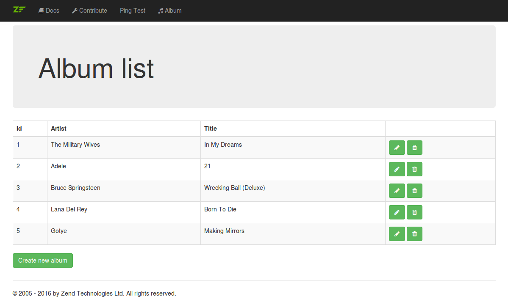
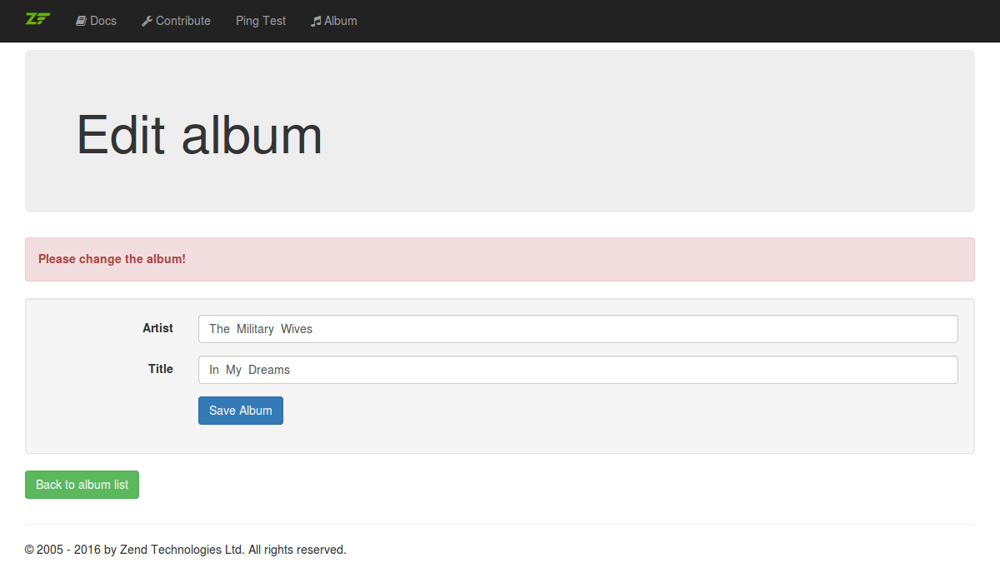
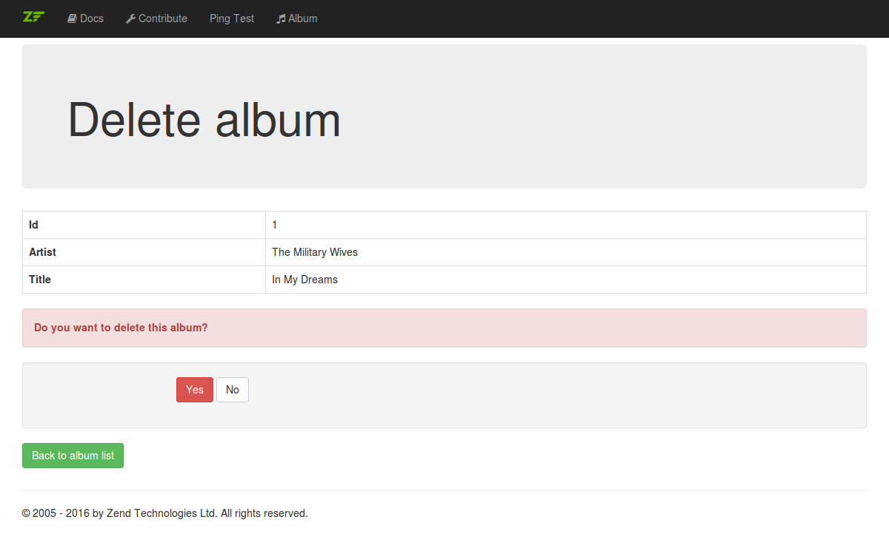

# Part 5: Updating and deleting albums

In this part of the tutorial we will handle the updating and deleting of
existing albums. Similar to the album creation action we will create all
actions and factories needed. For the update we can reuse the album data
form, for deletion we will create a new delete form.

## Update album configuration and create new album middleware

First, we will update the album configuration in the
`/src/Album/src/ConfigProvider.php` file to add new middleware actions,
a form and some routes.

* In the `dependencies` section four new middleware with its factories are
  added. These will be created in the next steps.

   * The `AlbumUpdateFormAction` will show the update form for an album.
   * The `AlbumUpdateHandleAction` will handle the update form processing.
   * The `AlbumDeleteFormAction` will show the delete form for an album.
   * The `AlbumDeleteHandleAction` will handle the update form processing.

* Additionally, a new delete album form is also registered for the DI
  Container. The form will be created as well in the next steps.

```php
<?php
/* ... */

    /**
     * Returns the container dependencies
     *
     * @return array
     */
    public function getDependencies()
    {
        return [
            'invokables' => [
            ],
            'factories'  => [
                Action\AlbumListAction::class =>
                    Action\AlbumListActionFactory::class,
                Action\AlbumCreateFormAction::class =>
                    Action\AlbumCreateFormActionFactory::class,
                Action\AlbumCreateHandleAction::class =>
                    Action\AlbumCreateHandleActionFactory::class,
                Action\AlbumUpdateFormAction::class =>
                    Action\AlbumUpdateFormActionFactory::class,
                Action\AlbumUpdateHandleAction::class =>
                    Action\AlbumUpdateHandleActionFactory::class,
                Action\AlbumDeleteFormAction::class =>
                    Action\AlbumDeleteFormActionFactory::class,
                Action\AlbumDeleteHandleAction::class =>
                    Action\AlbumDeleteHandleActionFactory::class,

                Model\Repository\AlbumRepositoryInterface::class =>
                    Model\Repository\AlbumRepositoryFactory::class,

                Model\InputFilter\AlbumInputFilter::class =>
                    Model\InputFilter\AlbumInputFilterFactory::class,

                Model\Storage\AlbumStorageInterface::class =>
                    Db\AlbumTableGatewayFactory::class,

                Form\AlbumDataForm::class =>
                    Form\AlbumDataFormFactory::class,
                Form\AlbumDeleteForm::class =>
                    Form\AlbumDeleteFormFactory::class,
            ],
        ];
    }

/* ... */
```

* In the `/config/routes.php` file four new routes will be added for the four new
  middleware actions. Some are only processed for GET requests, some only
  for POST requests.

```php
<?php
/* ... */
$app->get("/album/update/{id:\d+}", [
    Album\Action\AlbumUpdateFormAction::class,
], 'album-update');
$app->post("/album/update/{id:\d+}/handle", [
    Album\Action\AlbumUpdateHandleAction::class,
    Album\Action\AlbumUpdateFormAction::class,
], 'album-update-handle');
$app->get("/album/delete/{id:\d+}", [
    Album\Action\AlbumDeleteFormAction::class,
], 'album-delete');
$app->post("/album/delete/{id:\d+}/handle", [
    Album\Action\AlbumDeleteHandleAction::class,
    Album\Action\AlbumDeleteFormAction::class,
], 'album-delete-handle');
```

## Add links to the album list page

Next, you need to add a link to the update and the delete page for each
album in the album list. Please open the `/src/Album/templates/album/list.phtml` and
update the `foreach()` loop. You can generate the URLs with the `url` view
helper and display them in the table at the end of each row.

```html
    <?php foreach ($this->albumList as $albumEntity) : ?>
        <?php
        $urlParams = ['id' => $albumEntity->getId()];
        $updateUrl = $this->url('album-update', $urlParams);
        $deleteUrl = $this->url('album-delete', $urlParams);
        ?>
        <tr>
            <td><?= $albumEntity->getId() ?></td>
            <td><?= $albumEntity->getArtist() ?></td>
            <td><?= $albumEntity->getTitle() ?></td>
            <td>
                <a href="<?= $updateUrl ?>" class="btn btn-success">
                    <i class="fa fa-pencil"></i>
                </a>
                <a href="<?= $deleteUrl ?>" class="btn btn-success">
                    <i class="fa fa-trash"></i>
                </a>
            </td>
        </tr>
    <?php endforeach; ?>
```

This is what it will look like if You browse to [http://localhost:8080/album](http://localhost:8080/album)



## Add update action to show form

Next, you need to create the `AlbumUpdateFormAction` middleware.
```bash
$ ./vendor/bin/expressive middleware:create "Album\Action\AlbumUpdateFormAction"
```
The file `/src/Album/src/Action/AlbumUpdateFormAction.php` will look like the following:
```php
<?php

namespace Album\Action;

use Interop\Http\ServerMiddleware\DelegateInterface;
use Interop\Http\ServerMiddleware\MiddlewareInterface;
use Psr\Http\Message\ServerRequestInterface;

class AlbumUpdateFormAction implements MiddlewareInterface
{
    /**
     * {@inheritDoc}
     */
    public function process(ServerRequestInterface $request, DelegateInterface $delegate)
    {
        // $response = $delegate->process($request);
    }
}
```

Now, modify it's content such that it looks like below.
Please note the following:

* The `AlbumUpdateFormAction` has three dependencies to the template
  renderer, the album repository and the album form. All of these
  dependencies can be injected with the constructor.

* The `process()` method is run when the middleware is processed.

  * First the `id` is taken from the routing to read the current
    `AlbumEntity` to update.

  * If the form validation was started and failed, then the form has some
    messages set. In that case an appropriate message is set for the form.

  * If the form validation was not run, then a different message is set for
    the form. Additionally, the `AlbumEntity` instance is bound to the
    form. When this is done the form uses the injected hydrator to extract
    the data from the entity and passes it to the form elements to set
    their values.

  * Next, the `$data` array is built with the form, the entity and the
    message.

  * Finally, the update template is rendered and a `HtmlResponse` is
    passed back.

```php
<?php
namespace Album\Action;

use Album\Form\AlbumDataForm;
use Album\Model\Repository\AlbumRepositoryInterface;
use Interop\Http\ServerMiddleware\DelegateInterface;
use Interop\Http\ServerMiddleware\MiddlewareInterface as ServerMiddlewareInterface;
use Psr\Http\Message\ResponseInterface;
use Psr\Http\Message\ServerRequestInterface;
use Zend\Diactoros\Response\HtmlResponse;
use Zend\Expressive\Template\TemplateRendererInterface;

/**
 * Class AlbumUpdateFormAction
 *
 * @package Album\Action
 */
class AlbumUpdateFormAction implements ServerMiddlewareInterface
{
    /**
     * @var TemplateRendererInterface
     */
    private $template;

    /**
     * @var AlbumRepositoryInterface
     */
    private $albumRepository;

    /**
     * @var AlbumDataForm
     */
    private $albumForm;

    /**
     * AlbumUpdateFormAction constructor.
     *
     * @param TemplateRendererInterface $template
     * @param AlbumRepositoryInterface  $albumRepository
     * @param AlbumDataForm             $albumForm
     */
    public function __construct(
        TemplateRendererInterface $template,
        AlbumRepositoryInterface $albumRepository,
        AlbumDataForm $albumForm
    ) {
        $this->template  = $template;
        $this->albumRepository = $albumRepository;
        $this->albumForm = $albumForm;
    }

    /**
     * {@inheritDoc}
     */
    public function process(ServerRequestInterface $request, DelegateInterface $delegate)
    {
        $id = $request->getAttribute('id');

        $album = $this->albumRepository->fetchSingleAlbum($id);

        if ($this->albumForm->getMessages()) {
            $message = 'Please check your input!';
        } else {
            $message = 'Please change the album!';

            $this->albumForm->bind($album);
        }

        $data = [
            'albumForm'   => $this->albumForm,
            'albumEntity' => $album,
            'message'     => $message,
        ];

        return new HtmlResponse(
            $this->template->render('album::update', $data)
        );
    }
}
```

Let's create the factory with another `expressive-tool` which comes with `zend-servicemanager`
since version `3.2`.
Matthew Setter explains some dateils in a [blog post](http://www.masterzendframework.com/simple-factory-generation-with-factorycreator).

```bash
$ ./vendor/bin/generate-factory-for-class "Album\Action\AlbumUpdateFormAction" > src/Album/src/Album/Action/AlbumUpdateFormFactory.php
```

The corresponding factory will be created in the new
`AlbumUpdateFormFactory.php` file. It looks much similar to the
`AlbumCreateFormFactory` and requests the three dependencies from the DI
container to pass them to the constructor of the `AlbumUpdateFormAction`.

```php
<?php

namespace Album\Action;

use Interop\Container\ContainerInterface;
use Zend\ServiceManager\Factory\FactoryInterface;
use Album\Action\AlbumUpdateFormAction;

class AlbumUpdateFormActionFactory implements FactoryInterface
{
    /**
     * @param ContainerInterface $container
     * @param string $requestedName
     * @param null|array $options
     * @return AlbumUpdateFormAction
     */
    public function __invoke(ContainerInterface $container, $requestedName, array $options = null)
    {
        return new AlbumUpdateFormAction();
    }
}
```

It already contains everything we need. Let's modify itto the following.

```php
<?php

namespace Album\Action;

use Album\Form\AlbumDataForm;
use Album\Model\Repository\AlbumRepositoryInterface;
use Interop\Container\ContainerInterface;
use Zend\Expressive\Template\TemplateRendererInterface;
use Zend\ServiceManager\Factory\FactoryInterface;

/**
 * Class AlbumUpdateFormActionFactory
 *
 * @package Album\Action
 */
class AlbumUpdateFormActionFactory implements FactoryInterface
{
    /**
     * @param ContainerInterface $container
     * @param string $requestedName
     * @param null|array $options
     * @return AlbumUpdateFormAction
     */
    public function __invoke(ContainerInterface $container, $requestedName, array $options = null)
    {
        return new AlbumUpdateFormAction(
            $container->get(TemplateRendererInterface::class),
            $container->get(AlbumRepositoryInterface::class),
            $container->get(AlbumDataForm::class)
        );
    }
}
```

## Add update action for form handling

Create the middleware using the `expressive-tool`.
```bash
$ ./vendor/bin/expressive middleware:create "Album\Action\AlbumUpdateHandleAction"
```
Modify the `AlbumUpdateHandleAction.php` file in the
existing `/src/Album/Action/` path to handle the update form processing.
Please note the following:

* The `AlbumUpdateHandleAction` has three dependencies to the router, the
  album repository and the album form. All of these dependencies can be
  injected with the constructor.

* The `process()` method is run when the form is processed.

  * The `id` is read from the request attributes.

  * The POST data is also read from the request.

  * Then the POST data is passed to the form and the form is validated.

  * If the validation was successful...

    * The `AlbumEntity` is fetched from the repository and the POST data
      is passed to it.

    * The album is saved and a redirect to the album list is made.

  * If the form validation failed...

    * The next middleware is processed which is the `AlbumUpdateFormAction`
      to show the update form.

```php
<?php

namespace Album\Action;

use Album\Form\AlbumDataForm;
use Album\Model\Repository\AlbumRepositoryInterface;
use Interop\Http\ServerMiddleware\DelegateInterface;
use Interop\Http\ServerMiddleware\MiddlewareInterface as ServerMiddlewareInterface;
use Psr\Http\Message\ResponseInterface;
use Psr\Http\Message\ServerRequestInterface;
use Zend\Diactoros\Response\HtmlResponse;
use Zend\Diactoros\Response\RedirectResponse;
use Zend\Expressive\Router\RouterInterface;

/**
 * Class AlbumUpdateHandleAction
 *
 * @package Album\Action
 */
class AlbumUpdateHandleAction implements ServerMiddlewareInterface
{
    /**
     * @var RouterInterface
     */
    private $router;

    /**
     * @var AlbumRepositoryInterface
     */
    private $albumRepository;

    /**
     * @var AlbumDataForm
     */
    private $albumForm;

    /**
     * AlbumUpdateHandleAction constructor.
     *
     * @param RouterInterface          $router
     * @param AlbumRepositoryInterface $albumRepository
     * @param AlbumDataForm            $albumForm
     */
    public function __construct(
        RouterInterface $router,
        AlbumRepositoryInterface $albumRepository,
        AlbumDataForm $albumForm
    ) {
        $this->router          = $router;
        $this->albumRepository = $albumRepository;
        $this->albumForm       = $albumForm;
    }

    /**
     * {@inheritDoc}
     */
    public function process(ServerRequestInterface $request, DelegateInterface $delegate)
    {
        $id = $request->getAttribute('id');

        $postData = $request->getParsedBody();

        $this->albumForm->setData($postData);

        if ($this->albumForm->isValid()) {
            $postData['id'] = $id;

            $album = $this->albumRepository->fetchSingleAlbum($id);
            $album->exchangeArray($postData);

            $this->albumRepository->saveAlbum($album);

            return new RedirectResponse(
                $this->router->generateUri('album')
            );
        }

        return $delegate->process($request);
    }
}
```

The needed factory will be created in the new
`AlbumUpdateHandleActionFactory.php` file. It looks much similar to the
`AlbumCreateHandleFactory` and requests the three needed dependencies from
the DI container to pass them to the constructor of the
`AlbumUpdateHandleAction`.

```bash
$ ./vendor/bin/generate-factory-for-class "Album\Action\AlbumUpdateHandleAction" > src/Album/src/Album/Action/AlbumUpdateHandleFactory.php
```

```php
<?php

namespace Album\Action;

use Album\Form\AlbumDataForm;
use Album\Model\Repository\AlbumRepositoryInterface;
use Interop\Container\ContainerInterface;
use Zend\ServiceManager\Factory\FactoryInterface;
use Zend\Expressive\Router\RouterInterface;

class AlbumUpdateHandleActionFactory implements FactoryInterface
{
    /**
     * @param ContainerInterface $container
     * @param string $requestedName
     * @param null|array $options
     * @return AlbumUpdateHandleAction
     */
    public function __invoke(ContainerInterface $container, $requestedName, array $options = null)
    {
        return new AlbumUpdateHandleAction(
            $container->get(RouterInterface::class),
            $container->get(AlbumRepositoryInterface::class),
            $container->get(AlbumDataForm::class)
        );
    }
}
```

## Create update template

Now you need to create the `update.phtml` file in the `/src/Album/templates/album/`
path. In this template you need to setup the form with an form action and
display it. Again the form is rendered by using the `form`, the
`formLabel`, the `formElement` and the `formElementErrors` view helpers
for the form elements and the submit button.

```php
<?php
use Album\Form\AlbumDataForm;
use Album\Model\Entity\AlbumEntity;

/** @var AlbumEntity $album */
$album = $this->albumEntity;

/** @var AlbumDataForm $form */
$form = $this->albumForm;
$form->setAttribute(
    'action', $this->url('album-update-handle', ['id' => $album->getId()])
);

$this->headTitle('Edit album');
?>

<div class="jumbotron">
    <h1>Edit album</h1>
</div>

<div class="alert alert-danger">
    <strong><?= $this->message ?></strong>
</div>

<div class="well">
    <?= $this->form()->openTag($form) ?>
    <div class="form-group">
        <?= $this->formLabel($form->get('artist')) ?>
        <div class="col-sm-10">
            <?= $this->formElement($form->get('artist')) ?>
            <?= $this->formElementErrors($form->get('artist')) ?>
        </div>
    </div>
    <div class="form-group">
        <?= $this->formLabel($form->get('title')) ?>
        <div class="col-sm-10">
            <?= $this->formElement($form->get('title')) ?>
            <?= $this->formElementErrors($form->get('title')) ?>
        </div>
    </div>
    <div class="form-group">
        <div class="col-sm-offset-2 col-sm-10">
            <?= $this->formElement($form->get('save_album')) ?>
        </div>
    </div>
    <?= $this->form()->closeTag() ?>
</div>

<p>
    <a href="<?= $this->url('album') ?>" class="btn btn-success">
        Back to album list
    </a>
</p>
```

This is what it will look like if You browse to [http://localhost:8080/album/update/1](http://localhost:8080/album/update/1)



## Add delete form

To delete an album we will create another form with two submit buttons.
Please create the new file `AlbumDeleteForm.php` in the `/src/Album/src/Form/`
path. This form just adds two submit buttons. One to confirm the deletion
and on to cancel it.

```php
<?php

namespace Album\Form;

use Zend\Form\Form;

/**
 * Class AlbumDeleteForm
 *
 * @package Album\Form
 */
class AlbumDeleteForm extends Form
{
    /**
     * Init form
     */
    public function init()
    {
        $this->setName('album_delete_form');
        $this->setAttribute('class', 'form-horizontal');

        $this->add(
            [
                'name'       => 'delete_album_yes',
                'type'       => 'Submit',
                'attributes' => [
                    'class' => 'btn btn-danger',
                    'value' => 'Yes',
                    'id'    => 'delete_album_yes',
                ],
            ]
        );

        $this->add(
            [
                'name'       => 'delete_album_no',
                'type'       => 'Submit',
                'attributes' => [
                    'class' => 'btn btn-default',
                    'value' => 'No',
                    'id'    => 'delete_album_no',
                ],
            ]
        );
    }
}
```

The `AlbumDeleteFormFactory` for this form is created in the
`AlbumDeleteFormFactory.php` file and quite simple. It needs no
dependencies to inject and just runs the `init()` method of the form.

```php
<?php
namespace Album\Form;

use Interop\Container\ContainerInterface;
use Zend\Form\Form;

/**
 * Class AlbumDeleteFormFactory
 *
 * @package Album\Form
 */
class AlbumDeleteFormFactory extends Form
{
    /**
     * @param ContainerInterface $container
     *
     * @return AlbumDeleteForm
     */
    public function __invoke(ContainerInterface $container)
    {
        $form = new AlbumDeleteForm();
        $form->init();

        return $form;
    }
}
```

## Add delete action to show form

Create the middleware using the `expressive-tool`.
```bash
$ ./vendor/bin/expressive middleware:create "Album\Action\AlbumDeleteFormAction"
```
Again we will need a middleware action to show the form. This is done
in the `AlbumDeleteFormAction.php` file. This middleware is very similar
to the `AlbumUpdateFormAction` above. The main difference is that it uses
the new delete form and sets a different message.

```php
<?php

namespace Album\Action;

use Interop\Http\ServerMiddleware\DelegateInterface;
use Interop\Http\ServerMiddleware\MiddlewareInterface as ServerMiddlewareInterface;
use Psr\Http\Message\ResponseInterface;
use Psr\Http\Message\ServerRequestInterface;
use Zend\Diactoros\Response\HtmlResponse;
use Zend\Expressive\Template\TemplateRendererInterface;
use Album\Form\AlbumDeleteForm;
use Album\Model\Repository\AlbumRepositoryInterface;

/**
 * Class AlbumDeleteFormAction
 *
 * @package Album\Action
 */
class AlbumDeleteFormAction implements ServerMiddlewareInterface
{
    /**
     * @var TemplateRendererInterface
     */
    private $template;

    /**
     * @var AlbumRepositoryInterface
     */
    private $albumRepository;

    /**
     * @var AlbumDeleteForm
     */
    private $albumForm;

    /**
     * AlbumDeleteFormAction constructor.
     *
     * @param TemplateRendererInterface $template
     * @param AlbumRepositoryInterface  $albumRepository
     * @param AlbumDeleteForm           $albumForm
     */
    public function __construct(
        TemplateRendererInterface $template,
        AlbumRepositoryInterface $albumRepository,
        AlbumDeleteForm $albumForm
    ) {
        $this->template  = $template;
        $this->albumRepository = $albumRepository;
        $this->albumForm = $albumForm;
    }

    /**
     * {@inheritDoc}
     */
    public function process(ServerRequestInterface $request, DelegateInterface $delegate)
    {
        $id = $request->getAttribute('id');

        $album = $this->albumRepository->fetchSingleAlbum($id);

        $message = 'Do you want to delete this album?';

        $this->albumForm->bind($album);

        $data = [
            'albumEntity' => $album,
            'albumForm'   => $this->albumForm,
            'message'     => $message,
        ];

        return new HtmlResponse(
            $this->template->render('album::delete', $data)
        );
    }
}
```

The `AlbumDeleteFormFactory` is also quite similar to the
`AlbumUpdateFormFactory` above. The only difference is the injection of
the delete form during instantiation of `AlbumDeleteFormAction`.

```php
<?php

namespace Album\Action;

use Album\Form\AlbumDeleteForm;
use Album\Model\Repository\AlbumRepositoryInterface;
use Interop\Container\ContainerInterface;
use Zend\Expressive\Template\TemplateRendererInterface;
use Zend\ServiceManager\Factory\FactoryInterface;

/**
 * Class AlbumDeleteFormActionFactory
 *
 * @package Album\Action
 */
class AlbumDeleteFormActionFactory implements FactoryInterface
{
    /**
     * @param ContainerInterface $container
     * @param string $requestedName
     * @param null|array $options
     * @return AlbumDeleteFormAction
     */
    public function __invoke(ContainerInterface $container, $requestedName, array $options = null)
    {
        return new AlbumDeleteFormAction(
            $container->get(TemplateRendererInterface::class),
            $container->get(AlbumRepositoryInterface::class),
            $container->get(AlbumDeleteForm::class)
        );
    }
}
```

## Add delete action for form handling

Create the middleware using the `expressive-tool`.
```bash
$ ./vendor/bin/expressive middleware:create "Album\Action\AlbumDeleteHandleAction"
```
For the deletion handling you need to create the `AlbumDeleteHandleAction.php`
which works different than the form handling middleware actions for album
creation and updating. In the `process()` method it checks if the
deletion confirm button named `delete_album_yes` was sent to delete the
album. No matter which submit button was sent, a redirect to the album
list is created at the end.

```php
<?php

namespace Album\Action;

use Interop\Http\ServerMiddleware\DelegateInterface;
use Interop\Http\ServerMiddleware\MiddlewareInterface as ServerMiddlewareInterface;
use Psr\Http\Message\ResponseInterface;
use Psr\Http\Message\ServerRequestInterface;
use Zend\Diactoros\Response\HtmlResponse;
use Zend\Diactoros\Response\RedirectResponse;
use Zend\Expressive\Router\RouterInterface;
use Album\Model\Repository\AlbumRepositoryInterface;

/**
 * Class AlbumDeleteHandleAction
 *
 * @package Album\Action
 */
class AlbumDeleteHandleAction implements ServerMiddlewareInterface
{
    /**
     * @var RouterInterface
     */
    private $router;

    /**
     * @var AlbumRepositoryInterface
     */
    private $albumRepository;


    /**
     * AlbumDeleteHandleAction constructor.
     *
     * @param RouterInterface          $router
     * @param AlbumRepositoryInterface $albumRepository
     */
    public function __construct(
        RouterInterface $router,
        AlbumRepositoryInterface $albumRepository
    ) {
        $this->router          = $router;
        $this->albumRepository = $albumRepository;
    }

    /**
     * {@inheritDoc}
     */
    public function process(ServerRequestInterface $request, DelegateInterface $delegate)
    {
        $id = $request->getAttribute('id');

        $album = $this->albumRepository->fetchSingleAlbum($id);

        $postData = $request->getParsedBody();

        if (isset($postData['delete_album_yes'])) {
            $this->albumRepository->deleteAlbum($album);
        }

        return new RedirectResponse(
            $this->router->generateUri('album')
        );
    }
}
```

The `AlbumDeleteHandleActionFactory` just requests the router and the album
repository and injects them into the instantiation of the
`AlbumDeleteHandleAction`.

```php
<?php

namespace Album\Action;

use Album\Model\Repository\AlbumRepositoryInterface;
use Interop\Container\ContainerInterface;
use Zend\ServiceManager\Factory\FactoryInterface;
use Zend\Expressive\Router\RouterInterface;

class AlbumDeleteHandleActionFactory implements FactoryInterface
{
    /**
     * @param ContainerInterface $container
     * @param string $requestedName
     * @param null|array $options
     * @return AlbumDeleteHandleAction
     */
    public function __invoke(ContainerInterface $container, $requestedName, array $options = null)
    {
        return new AlbumDeleteHandleAction(
            $container->get(RouterInterface::class),
            $container->get(AlbumRepositoryInterface::class)
        );
    }
}
```

## Create delete template

Finally, the `delete.phtml` template file in the `/src/Album/templates/album/` path
is needed to setup the form action and to display the delete form.

```php
<?php
use Album\Form\AlbumDeleteForm;
use Album\Model\Entity\AlbumEntity;

/** @var AlbumEntity $album */
$album = $this->albumEntity;

/** @var AlbumDataForm $form */
$form = $this->albumForm;
$form->setAttribute(
    'action', $this->url('album-delete-handle', ['id' => $album->getId()])
);

$this->headTitle('Delete album');
?>

<div class="jumbotron">
    <h1>Delete album</h1>
</div>

<table class="table table-bordered">
    <tr>
        <th>Id</th>
        <td><?= $album->getId() ?></td>
    </tr>
    <tr>
        <th>Artist</th>
        <td><?= $album->getArtist() ?></td>
    </tr>
    <tr>
        <th>Title</th>
        <td><?= $album->getTitle() ?></td>
    </tr>
</table>

<div class="alert alert-danger">
    <strong><?= $this->message ?></strong>
</div>

<div class="well">
    <?= $this->form()->openTag($form) ?>
    <div class="form-group">
        <div class="col-sm-offset-2 col-sm-10">
            <?= $this->formElement($form->get('delete_album_yes')) ?>
            <?= $this->formElement($form->get('delete_album_no')) ?>
        </div>
    </div>
    <?= $this->form()->closeTag() ?>
</div>

<p>
    <a href="<?= $this->url('album') ?>" class="btn btn-success">
        Back to album list
    </a>
</p>
```

Now you can browse to
[http://localhost:8080/album/delete/1](http://localhost:8080/album/delete/1)
to see if the delete form works correctly. Try to delete the album.



## Compare with example repository branch `part5`

You can easily compare your code with the example repository when looking
at the branch `part5`. If you want you can even clone it and have a deeper
look.

[https://github.com/lowtower/zend-expressive2-tutorial/tree/part5](https://github.com/lowtower/zend-expressive2-tutorial/tree/part5_updating-and-deleting)
